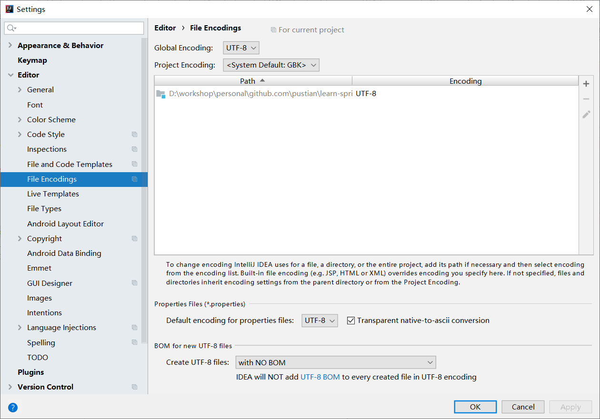

### 国际化

### spring mvc

> 1. 国际化配置文件编写
>2. 使用ResourceBundleMessageSource管理国际化资源文件
> 3. 在页面使用fmt:message 获取国际化内容

### springboot已配置

> 国际化配置文件编写.
> MessageSourceAutoConfiguration

> ```
> spring:
> 	messages:
>     	basename: i18.message
> ```
>
> message.properties
>
> message_zh_CN.properties
>
> message_en_US.properties

>login.html 中通过#{} 获取国际化的值

properties中编码的问题




### 点击链接切换国际化

根据http请求头里的accept-language获取locale来做语言适配的

```
@Bean
@ConditionalOnMissingBean
@ConditionalOnProperty(prefix = "spring.mvc", name = "locale")
public LocaleResolver localeResolver() {
   if (this.mvcProperties
         .getLocaleResolver() == WebMvcProperties.LocaleResolver.FIXED) {
      return new FixedLocaleResolver(this.mvcProperties.getLocale());
   }
   AcceptHeaderLocaleResolver localeResolver = new AcceptHeaderLocaleResolver();
   localeResolver.setDefaultLocale(this.mvcProperties.getLocale());
   return localeResolver;
}
```

在请求时携带区域信息

```html
        <a class="btn btn-sn" th:href="@{index.html(lang='zh_CN')}">中文</a>
        <a class="btn btn-sn" th:href="@{index.html(lang='en_US')}">English</a>
```

自己处理localeResolver

```java
// 此处名字必须限制
@Component("localeResolver")
public class LocaleResolverExt implements LocaleResolver {
    @Override
    public Locale resolveLocale(HttpServletRequest httpServletRequest) {
        String lang = httpServletRequest.getParameter("lang");
        Locale locale = Locale.getDefault();
        if(StringUtils.isNoneBlank(lang) ) {
            String[] split = lang.split("_");
            locale = new Locale(split[0], split[1]);
        }
        return locale;
    }

    @Override
    public void setLocale(HttpServletRequest httpServletRequest, HttpServletResponse httpServletResponse, Locale locale) {
    }
}
```

### login

模板页面修改实时生效

> 1，禁用模板缓存
>
> 2， 强制重新编译页面 Ctrl+F9

