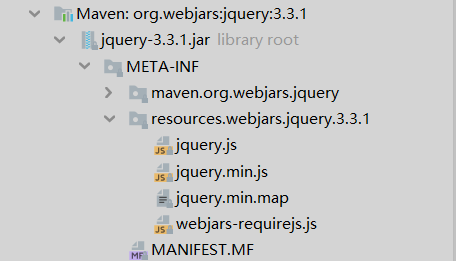

# SpringBoot 对静态资源的映射规则

### controller 层中

> 使用Controller注解
>
> + 想用json返还在方法中添加 @ResponseBody

```bash
@Controller
public class IndexController {
    @GetMapping("/hello")
    @ResponseBody
    public String hello() {
        return "hello world";
    }

    @RequestMapping(value = {"/", "/index", "/index.html", "/home", })
    public String home(Model model) {
        return "index";
    }
}
```

### 静态资源

> favicon.ico 直接放到static下
>
> 页面模板放在 template

### webjars 以jar包的方式引入静态资源

> cdn是否更好些？

所有/webjars/**,都去classpath:/META-INF/resources/webjars/ 下找资源：
http://www.webjars.org
引入jquery-webjar

```xml
        <dependency>
            <groupId>org.webjars</groupId>
            <artifactId>jquery</artifactId>
            <version>3.3.1</version>
        </dependency>
```

快速访问：http://localhost:8080/webjars/jquery/3.3.1/jquery.js




引用

快速访问：http://localhost:8080/webjars/jquery/jquery.js （推荐）

```bash
        <dependency><!--Webjars版本定位工具（前端）-->
            <groupId>org.webjars</groupId>
            <artifactId>webjars-locator-core</artifactId>
        </dependency>
```


## 一些代码介绍

#### 配置类

`WebMvcAutoConfiguration` 类 中`public void addResourceHandlers(ResourceHandlerRegistry registry) `

```java
public class WebMvcAutoConfiguration {
		@Override
		public void addResourceHandlers(ResourceHandlerRegistry registry) {
			if (!this.resourceProperties.isAddMappings()) {
				logger.debug("Default resource handling disabled");
				return;
			}
			Duration cachePeriod = this.resourceProperties.getCache().getPeriod();
			CacheControl cacheControl = this.resourceProperties.getCache()
					.getCachecontrol().toHttpCacheControl();
			if (!registry.hasMappingForPattern("/webjars/**")) {
				customizeResourceHandlerRegistration(registry
						.addResourceHandler("/webjars/**")
						.addResourceLocations("classpath:/META-INF/resources/webjars/")
						.setCachePeriod(getSeconds(cachePeriod))
						.setCacheControl(cacheControl));
			}
			String staticPathPattern = this.mvcProperties.getStaticPathPattern();
			if (!registry.hasMappingForPattern(staticPathPattern)) {
				customizeResourceHandlerRegistration(
						registry.addResourceHandler(staticPathPattern)
								.addResourceLocations(getResourceLocations(
										this.resourceProperties.getStaticLocations()))
								.setCachePeriod(getSeconds(cachePeriod))
								.setCacheControl(cacheControl));
			}
		}
}
```


#### 2) */** 访问任何资源（静态资源文件夹）
```bash
classpath:/META-INF/resources/
classpath:/resources/
classpath:/static/
classpath:/public/
/  # 当前项目的根路径
```

#### 3) 欢迎页，所有静态资源下的index.html
```java
public class WebMvcAutoConfiguration {
		@Bean
		public WelcomePageHandlerMapping welcomePageHandlerMapping(
				ApplicationContext applicationContext) {
			return new WelcomePageHandlerMapping(
					new TemplateAvailabilityProviders(applicationContext),
					applicationContext, getWelcomePage(),
					this.mvcProperties.getStaticPathPattern());
		}
        private Optional<Resource> getWelcomePage() {
            String[] locations = getResourceLocations(
                    this.resourceProperties.getStaticLocations());
            return Arrays.stream(locations).map(this::getIndexHtml)
                    .filter(this::isReadable).findFirst();
        }
        private Resource getIndexHtml(String location) {
            return this.resourceLoader.getResource(location + "index.html");
        }
}
```
#### 4) 所有的 **/favicon.ico 都是在静态资源文件夹下找
> https://tool.lu/favicon/
```java
public class WebMvcAutoConfiguration {
        @Configuration
        @ConditionalOnProperty(value = "spring.mvc.favicon.enabled",
                matchIfMissing = true)
        public static class FaviconConfiguration implements ResourceLoaderAware {
    
            private final ResourceProperties resourceProperties;
    
            private ResourceLoader resourceLoader;
    
            public FaviconConfiguration(ResourceProperties resourceProperties) {
                this.resourceProperties = resourceProperties;
            }
    
            @Override
            public void setResourceLoader(ResourceLoader resourceLoader) {
                this.resourceLoader = resourceLoader;
            }
    
            @Bean
            public SimpleUrlHandlerMapping faviconHandlerMapping() {
                SimpleUrlHandlerMapping mapping = new SimpleUrlHandlerMapping();
                mapping.setOrder(Ordered.HIGHEST_PRECEDENCE + 1);
                mapping.setUrlMap(Collections.singletonMap("**/favicon.ico",
                        faviconRequestHandler()));
                return mapping;
            }
    
            @Bean
            public ResourceHttpRequestHandler faviconRequestHandler() {
                ResourceHttpRequestHandler requestHandler = new ResourceHttpRequestHandler();
                requestHandler.setLocations(resolveFaviconLocations());
                return requestHandler;
            }
    
            private List<Resource> resolveFaviconLocations() {
                String[] staticLocations = getResourceLocations(
                        this.resourceProperties.getStaticLocations());
                List<Resource> locations = new ArrayList<>(staticLocations.length + 1);
                Arrays.stream(staticLocations).map(this.resourceLoader::getResource)
                        .forEach(locations::add);
                locations.add(new ClassPathResource("/"));
                return Collections.unmodifiableList(locations);
            }
    
        }
}
```
## 加载静态资源使用的配置，可以修改

application.yml

```properties
spring.resources.statis-locations
```

# 模板引擎
http://freemarker.foofun.cn/toc.html

jsp，velocity，Freemaker， thymeleaf

