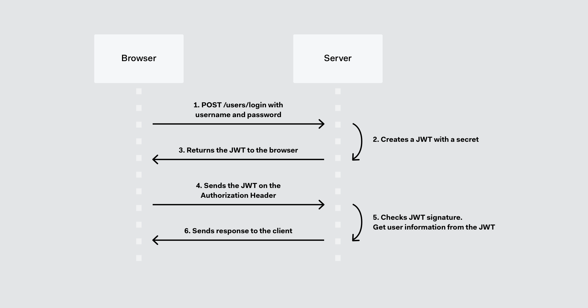

# JWT 基础知识
https://jwt.io/introduction/
### 简介
JWT包含了使用 . 分隔的三部分： 
1.Header 头部，包含了两部分：token类型和采用的加密算法。 
2.Payload 负载，Token的第二部分是负载，它包含了claim， Claim是一些实体（通常指的用户）的状态和额外的元数据。 
3.Signature 签名，创建签名需要使用编码后的header和payload以及一个秘钥，使用header中指定签名算法进行签名。 

下面是一个jjwt生成的token, base64 可以解开查看
```bash
eyJhbGciOiJIUzUxMiJ9
.eyJzdWIiOiJkZmRzYSIsImNyZWF0ZWQiOjE0OTQ5MjgzODQ1MzksInJvbGVzIjpbeyJhdXRob3JpdHkiOiJST0xFX0FOT05ZTU9VUyJ9LHsiYXV0aG9yaXR5IjoiUk9MRV9BRE1JTiJ9LHsiYXV0aG9yaXR5IjoiUk9MRV9VU0VSIn0seyJhdXRob3JpdHkiOiJST0xFX0RCQSJ9XSwiaWQiOjAsImV4cCI6MTQ5NTUzMzE4NH0
.RAWhCcFj7sfXI81zJ8fm0Rfb0IpwT7mNfuFPGzU6AblW2UdOgMtDExXlWZEr3pracdytsfw3os4dnJKM6ZW9mA
对应header和 payload解码后内容
{"alg":"HS512"}
{"sub":"dfdsa","created":1494928384539,"roles":[{"authority":"ROLE_ANONYMOUS"},{"authority":"ROLE_ADMIN"},{"authority":"ROLE_USER"},{"authority":"ROLE_DBA"}],"id":0,"exp":1495533184}
```
### jwt工作流程


1. 用户携带username和password请登录
2. 服务器验证登录验证，如果验证成功，根据用户的信息和服务器的规则生成JWT Token
3. 服务器将该token返回 
4. 用户得到token，存在localStorage、cookie或其它数据存储形式中。 
5. 以后用户请求服务器时，在请求的header中加入 Authorization: Bearer xxxx(token) 。此处注意token之前有一个7字符长度的“Bearer “，服务器端对此token进行检验，如果合法就解析其中内容，根据其拥有的权限和业务逻辑反回响应结果。 

JJWT
```xml
        <!-- https://mvnrepository.com/artifact/io.jsonwebtoken/jjwt -->
        <dependency>
            <groupId>io.jsonwebtoken</groupId>
            <artifactId>jjwt</artifactId>
            <version>0.9.1</version>
        </dependency>
```
```java
public final class JJwtTokenUtils {

    public static String generateToken(UserDetails userDetails, Map<String, Object> privateClaims) {
         String username = userDetails.getUsername();
         Long issuedAt = System.currentTimeMillis();
        return generateToken(ISSUER, SUBJECT, username, EXPIRATION, issuedAt,privateClaims);
    }

    public static Boolean validateToken(String token, UserDetails userDetails) {
        User user = (User) userDetails;
        final String username = getAudienceFromToken(token);
        return username.equals(user.getUsername()) && isTokenExpired(token) == false
                && ISSUER.equals(getIssuerFromToken(token)) && SUBJECT.equals(getSubjectFromToken(token) )
                ;
    }
}
```
注意此处时间

另外一套jwt
```xml
        <!-- https://mvnrepository.com/artifact/com.auth0/java-jwt -->
        <dependency>
            <groupId>com.auth0</groupId>
            <artifactId>java-jwt</artifactId>
            <version>3.10.2</version>
        </dependency>
```
```java
public final class JavaJwtTokenUtils {
    public static String sign(UserDetails userDetails) {
        String username = userDetails.getUsername();
        Long issuedAt = System.currentTimeMillis();
        return sign(ISSUER, SUBJECT, username, EXPIRATION, issuedAt);
    }

    public static boolean validateToken(String token, UserDetails userDetails) {
        Algorithm algorithm = Algorithm.HMAC512(TOKEN_SECRET);
        try {
            JWTVerifier verifier = JWT.require(algorithm).build();
            DecodedJWT jwt = verifier.verify(token);
            User user = (User) userDetails;
            List<String> aud = jwt.getAudience();
            return aud.contains(user.getUsername());
        }catch (AlgorithmMismatchException | SignatureVerificationException
                | TokenExpiredException | InvalidClaimException e) {
            e.printStackTrace();
            return false;
        }
    }
}
```
