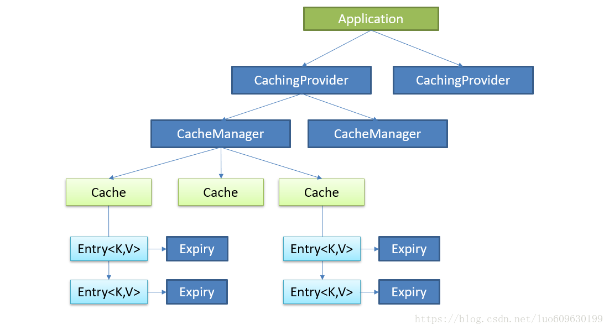
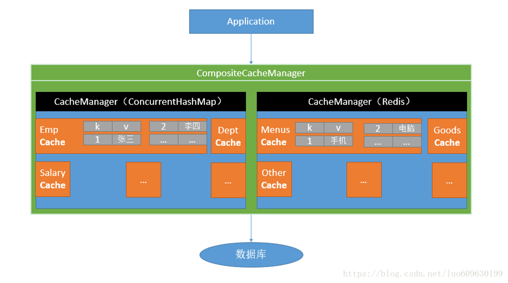

### JSR107 缓存规范



Java Caching定义了5个核心接口，分别是CachingProvider, CacheManager, Cache, Entry 和 Expiry。

> + CachingProvider定义了创建、配置、获取、管理和控制多个CacheManager。一个应用可以在运行期访问多个CachingProvider。
> + CacheManager定义了创建、配置、获取、管理和控制多个唯一命名的Cache，这些Cache存在于CacheManager的上下文中。一个CacheManager仅被一个CachingProvider所拥有。
> + Cache是一个类似Map的数据结构并临时存储以Key为索引的值。一个Cache仅被一个CacheManager所拥有。
> + Entry是一个存储在Cache中的key-value对。
> + Expiry 每一个存储在Cache中的条目有一个定义的有效期。一旦超过这个时间，条目为过期的状态。一旦过期，条目将不可访问、更新和删除。缓存有效期可以通过ExpiryPolicy设置。

### Spring缓存抽象

Spring从3.1开始定义了org.springframework.cache.Cache

和org.springframework.cache.CacheManager接口来统一不同的缓存技术

并支持使用JCache（JSR-107）注解简化我们开发

Cache接口下Spring提供了各种xxxCache的实现

> RedisCache，EhCacheCache , ConcurrentMapCache等；




### 几个重要的概念及缓存注解

| Spring         | 意义                                                         |
| -------------- | ------------------------------------------------------------ |
| Cache          | 缓存接口，定义缓存操作。<br />RedisCache、EhCacheCache、ConcurrentMapCache等 |
| CacheManager   | 缓存管理器，管理各种缓存（Cache）组件                        |
| @Cacheable     | 主要针对方法配置，能够根据方法的请求参数对其结果进行缓存     |
| @CacheEvict    | 主要针对方法配置，清空缓存                                   |
| @CachePut      | 主要针对方法配置，调用方法，结果又被保存                     |
| @EnableCaching | 开启基于注解的缓存                                           |
| keyGenerator   | 魂村数据时key的生成策略                                      |
| serialize      | 缓存数据时value序列化策略                                    |

Cacheable/CachePut/CacheEvict主要参数

| Value            |                                                              | 示例                                             |
| ---------------- | ------------------------------------------------------------ | ------------------------------------------------ |
| key              | 缓存的key，可以为空，如果指定按照SpEL 表达式编写。默认按照方法的所有参数进行组合 | @Cacheable(value="emp",key="#id")                |
| condition        | 缓存条件，可以为空，如果指定按照SpEL表达时编写,返回true/false。 true的时候执行操作。 | @Cacheable(value="emp",condition="#id < 100")    |
| allEntries       | 是否清空所有缓存，默认为false                                | @CacheEvict(value="emp", allEntries=true)        |
| beforeInvocation | 是否执行方法前就清空，默认false。 如果是true，则执行前清空缓存。缺省方法有异常时，不会清空缓存 | @CacheEvict(value="emp", beforeInvocation=true)  |
| unless           | 用于否决缓存的，不像condition，该表达式只在方法执行之后判断，此时可以拿到返回值result进行判断。条件为true不会缓存，fasle才缓存 | @Cacheable(value="emp",unless="#result == null") |
| sync             | 默认false，异步操作                                          |                                                  |


https://blog.csdn.net/yangliuhbhd/article/details/80626468

### 使用原理

1. 自动配置类；

   > 自动启动类 CacheAutoConfiguration
   >
   > 属性配置 CacheProperties
   >
   > 主启动类添加：@EnableCaching注解

2. 从缓存的配置类 中获取 多个cache

   ```java
   CacheConfigurationImportSelector.selectImports()方法获取
   
   static class CacheConfigurationImportSelector implements ImportSelector {
           @Override
           public String[] selectImports(AnnotationMetadata importingClassMetadata) {
               CacheType[] types = CacheType.values();
               String[] imports = new String[types.length];
               for (int i = 0; i < types.length; i++) {
                   imports[i] = CacheConfigurations.getConfigurationClass(types[i]);
               }
               return imports;
           }
   }
   ```

   ```bash
      # 获取结果
      org.springframework.boot.autoconfigure.cache.GenericCacheConfiguration
      org.springframework.boot.autoconfigure.cache.JCacheCacheConfiguration
      org.springframework.boot.autoconfigure.cache.EhCacheCacheConfiguration
      org.springframework.boot.autoconfigure.cache.HazelcastCacheConfiguration
      org.springframework.boot.autoconfigure.cache.InfinispanCacheConfiguration
      org.springframework.boot.autoconfigure.cache.CouchbaseCacheConfiguration
      org.springframework.boot.autoconfigure.cache.RedisCacheConfiguration
      org.springframework.boot.autoconfigure.cache.CaffeineCacheConfiguration
      org.springframework.boot.autoconfigure.cache.GuavaCacheConfiguration
      org.springframework.boot.autoconfigure.cache.SimpleCacheConfiguration【默认】
      org.springframework.boot.autoconfigure.cache.NoOpCacheConfiguration
   ```

3.  SimpleCacheConfiguration.cacheManager()

   ```java
   @Bean
   public ConcurrentMapCacheManager cacheManager() {
      ConcurrentMapCacheManager cacheManager = new ConcurrentMapCacheManager();
      List<String> cacheNames = this.cacheProperties.getCacheNames();
      if (!cacheNames.isEmpty()) {
         cacheManager.setCacheNames(cacheNames);
      }
      return this.customizerInvoker.customize(cacheManager);
   }
   ```

4.  查看获取缓存方法getCache（）

   ```java
   public Cache getCache(String name) {
      Cache cache = this.cacheMap.get(name); //cacheMap 为ConcurrentMap  类型，获取一个cache组件
      if (cache == null && this.dynamic) {
         synchronized (this.cacheMap) {
            cache = this.cacheMap.get(name); //cahceMap不为空获取
            if (cache == null) {
               //可以获取或者创建ConcurrentMapCache类型的缓存组件；他的作用将数据保存在ConcurrentMap中；
               cache = createConcurrentMapCache(name);   
               this.cacheMap.put(name, cache); //ConcurrentMapCache.lookup();
            }
         }
      }
      return cache;
   }
   ```

   

多级缓存策略 echcache redis

工作方式不一样，可以理解为ehcache是单机版缓存，redis是服务器版的缓存。

ehcache直接在jvm虚拟机中缓存，速度快，效率高；但是缓存共享麻烦，集群分布式应用不方便。
redis是通过socket访问到缓存服务，效率比ecache低，比数据库要快很多，处理集群和分布式缓存方便，有成熟的方案。

如果是单个应用或者对缓存访问要求很高的应用，用ehcache。
如果是大型系统，存在缓存共享、分布式部署、缓存内容很大的，建议用redis。

补充下：ehcache也有缓存共享方案，不过是通过RMI或者Jgroup多播方式进行广播缓存通知更新，缓存共享复杂，维护不方便；简单的共享可以，但是涉及到缓存恢复，大数据缓存，则不合适。

