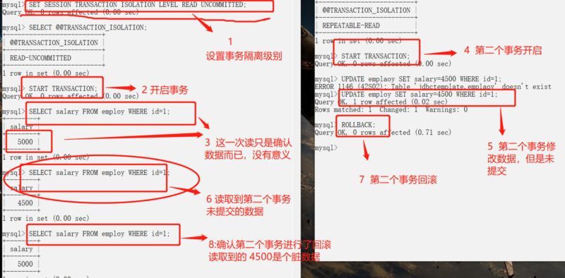

# 四种事务隔离级别

### 什么是事务

指作为单个逻辑工作单元执行的一系列操作，要么完全地执行，要么完全地不执行。

### 事务的基本要素（ACID）

+ 原子性（Atomicity）：事务开始后所有操作，要么全部做完，要么全部不做，不可能停滞在中间环节。

  ​		事务执行过程中出错，会回滚到事务开始前的状态，所有的操作就像没有发生一样。也就是说事务是一个不可分割的整体，就像化学中学过的原子，是物质构成的基本单位。

+ 一致性（Consistency）：事务开始前和结束后，数据库的完整性约束没有被破坏 。

  ​		比如A向B转账，不可能A扣了钱，B却没收到。

+ 隔离性（Isolation）：同一时间，只允许一个事务请求同一数据，不同的事务之间彼此没有任何干扰。

  ​		比如A正在从一张银行卡中取钱，在A取钱的过程结束前，B不能向这张卡转账。

+ 持久性（Durability）：事务完成后，事务对数据库的所有更新将被保存到数据库，不能回滚。

## 标准SQL事务隔离级别

|                  | 隔离级别 | 脏读   | 不可重复读 | 幻读                   |
| ---------------- | -------- | ------ | ---------- | ---------------------- |
| Read Uncommitted | 读未提交 | 可能   | 可能       | 可能                   |
| Read Committed   | 读已提交 | 不可能 | 可能       | 可能                   |
| Repeatable Read  | 可重复读 | 不可能 | 不可能     | Allowed, but not in PG |
| Serializable     | 可串行化 | 不可能 | 不可能     | 不可能                 |

### 事务的并发问题

低级别的隔离级一般支持更高的并发处理，并拥有更低的系统开销。

脏读（Dirty read）

丢失修改（Lost to modify）

不可重复读（Unrepeatableread）

幻读（Phantom read）


### 事务运行的三种模式

https://www.cnblogs.com/markkang/p/12052202.html

+ 自动提交事务
  	每条单独的语句都是一个事务，每个语句都隐含一个commit
    	
    	>每一条单独的SQL语句都在其执行完成后进行自动提交事务，即执行 SQL 语句后就会马上自动隐式执行 COMMIT 操作。如果出现错误，则进行事务回滚至之前状态。
    	>
    	>SQL SERVER和MY SQL中都默认开启自动提交事务，ORACLE则显式提交事务。这三种产品都提供了各自的方式来开闭自动提交事务模式，具体如下：
    	>
    	>+ 1）MYSQL中通过下面语句来开启或关闭当前会话或全局的自动提交事务模式。
    	>
    	>```
    	>set session autocommit=0;
    	>-- 0是关闭，1是开启；session是设置当前会话变量，global是设置全局变量
    	>```
    	>
    	>+ 2)SQL SERVER中使用下面语句来关闭或打开自动提交事务模式 。或者通过 Sql Server Managerment  Studio，在 Tools -> Options Query Execution -> SQL Server -> ANSI 选项中勾选SET IMPLICIT_TRANSACTIONS设置开启还是关闭自动事务提交模式。
    	>
    	>```
    	>SET IMPLICIT_TRANSACTIONS ON; 
    	>-- ON是打开隐式事务模式或关闭自动事务模式，OFF 是关闭隐式事务模式或打开自动提交事务模式
    	>```
    	>
    	>3）ORACLE通过如下语句开启或者关闭自动提交事务模式
    	>
    	>```
    	>set autocommit on; 
    	>-- on是开启自动事务模式，off是关闭自动提交事务模式
    	>```
  
+ 显式事务
      以begin transaction 开始，以commit 或 rollback 结束。
  
  > 通过指定事务开始语句来显式开启事务来作为开始，并由以提交命令或者回滚命令来提交或者回滚事务作为结束的一段代码就是一个用户定义的显式事务。
  >
  > SQL SERVER、MYSQL和ORACLE都以不同的方式来开始显式事务，具体如下：
  >
  > 1）SQL SERVER 以BEGIN [ TRAN | TRANSACTION ] 作为开始，以COMMIT [ WORK | TRAN | TRANSACTION ] 或者 ROLLBACK [ WORK | TRAN | TRANSACTION ] 作为结束。
  >
  > 2）MYSQL 以START TRANSACTION | BEGIN [WORK]作为开始，以COMMIT [ WORK ] 或者 ROLLBACK [ WORK ] 作为结束。
  >
  > 3）ORACLE事务起始于第一条SQL语句的执行，不需要特别指定事务的开始和结束，一个事务结束就意味着下一事务开始。以COMMIT或不带有SAVEPOINT子句的ROLLBACK命令作为结束。
  
+ 隐性事务
      在前一个事务完成时，新事务隐式启动，但每个事务仍以commit或rollback显示结束
  
  > 隐式事务中，无需使用BEGIN TRANASACTION 来开启事务，每个SQL语句第一次执行就会开启一个事务，直到用COMMIT [TRANSACTION]来提交或者ROLLBACK [TRANSACTION]来回滚结束事务。
  >
  > 1）SQL SERVER中使用下面语句来开启和关闭隐式事务模式。或者通过 Sql Server Managerment  Studio，在 Tools -> Options Query Execution -> SQL Server -> ANSI 选项中勾选SET IMPLICIT_TRANSACTIONS设置开启还是关闭隐式事务模式。
  >
  > ```
  > SET IMPLICIT_TRANSACTIONS ON --ON是开启，OFF是关闭
  > ```
  >
  >  2）ORACLE默认就是隐式开启事务，显式提交事务。可以通过下面语句开启自动提交事务，以达到隐式提交事务。
  >
  > ```
  > SET autocommit ON; -- on是开启自动事务模式，off是关闭自动提交事务模式
  > ```
  >
  > 3）MYSQL通过关闭自动提交事务，来达到隐式开启事务，显式提交事务的目的。
  >
  > ```
  > SET session autocommit = 0; -- 0是关闭，1是开启；session是设置当前会话变量，global是设置全局变量
  > ```


## mysql为例理解实验事务隔离级别

mysql数据库，当且仅当引擎是InnoDB，才支持事务

```sql
select @@global.tx_isolation,@@tx_isolation;
```

### 修改隔离级别

```sql
SET [SESSION|GLOBAL] TRANSACTION ISOLATION LEVEL [READ UNCOMMITTED|READ COMMITTED|REPEATABLE READ|SERIALIZABLE]
```

验证

#### 准备数据

```bash
create table `test_tx` (
  `id` int(11) NOT NULL AUTO_INCREMENT,
  `name` varchar(32),
  `balance` decimal default 0,
  `gmt_create` datetime DEFAULT NULL,
  `gmt_modified` datetime DEFAULT NULL,
  PRIMARY KEY (`id`),
  unique index name_uq(name)
) ENGINE=InnoDB DEFAULT CHARSET=utf8 COMMENT='事物验证表';

insert into test_tx(name, balance, gmt_create , gmt_modified ) value(
"family",  10000, now(), now()
)

insert into test_tx(name, balance, gmt_create , gmt_modified ) value(
"wife",  4000, now(), now()
)

insert into test_tx(name, balance, gmt_create , gmt_modified ) value(
"husband",  3000, now(), now()
)
```


```sql
mysql> set GLOBAL TRANSACTION ISOLATION LEVEL READ COMMITTED ;
Query OK, 0 rows affected (0.00 sec)

mysql> select @@global.tx_isolation,@@tx_isolation;
+-----------------------+-----------------+
| @@global.tx_isolation | @@tx_isolation  |
+-----------------------+-----------------+
| READ-COMMITTED        | REPEATABLE-READ |
+-----------------------+-----------------+
1 row in set (0.00 sec)
```

#### 示例

1， 丈夫准备存 2000到 family账户中， 

2， 妻子查询family账户 [脏数据]

3，丈夫发现钱不够，撤销转账请求。

4， 此时妻子查询账户

#### read-uncommitted

##### 脏读（Dirty read）

`脏读`指一个事务读取了另外一个事务未提交的数据。

打开两个窗口或是终端，确认事务级别



终端1--模拟丈夫操作

```sql
set  SESSION TRANSACTION ISOLATION LEVEL READ UNCOMMITTED ; 
select @@global.tx_isolation,@@tx_isolation;
select * from test_tx tt where name = 'family';
--- 1.1  begin save money --- 
start transaction;
--- 1.2
select * from test_tx tt where name = 'family';
--- 1.3
update test_tx set balance =balance + 2000 where  name = 'family';
--- 1.4
select * from test_tx tt where  name = 'family';
--- 1.5存储失败
rollback/commit
```

终端2--模拟妻子

```sql
 set  SESSION TRANSACTION ISOLATION LEVEL READ UNCOMMITTED ; 
select @@global.tx_isolation,@@tx_isolation;
--- 2.1  begin save money --- 
start transaction;
 --- 2.2恰好在丈夫账户操作前
select * from test_tx tt where  name = 'family';
--- 2.3 恰好在丈夫账户操作后
select * from test_tx tt where  name = 'family';
--- 2.4 提交后查询
select * from test_tx tt where  name = 'family';
--- 2.5 结束事务
commit
```

#### read-committed

read-commit事务隔离级别中，查询到的是未更新前的数据

##### 避免脏读(读已提交)


还是上面的例子

只是事务隔离级别换掉了 TRANSACTION ISOLATION LEVEL READ COMMITTED ; 

可以看到2.3 中的事务查询结果和1.4中的查询结果不一致。


##### 不可重复读

在终端2--模拟妻子中 1.5 执行后执行2.4 则发现2.4和2.3查询结果不一致。 此表现未不可重复读


同一个事务中前后读取到的结果不一致


同一个事务中前后读取到的结果一致

##### 幻读
两个事务对于同一条记录的修改，会出现记录等待的情况
